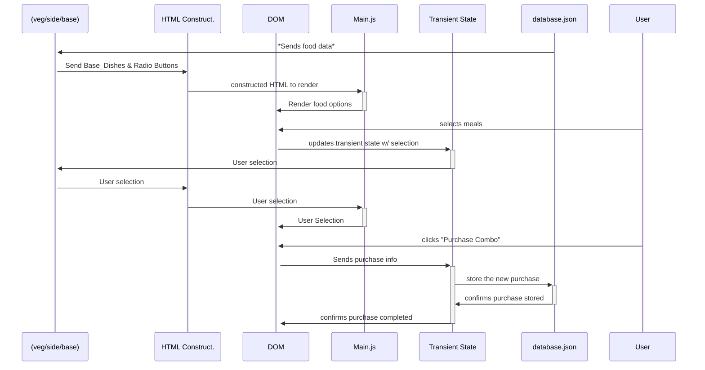

```mermaid
sequenceDiagram
    participant Modules as (veg/side/base)
    participant foodtruck.js as HTML Construct.
    participant UI as DOM
    participant Main as Main.js
    participant State as Transient State
    participant Data as database.json
    participant User as User
    Data->>+Modules: *Sends food data*
    Modules->>foodtruck.js: Send Base_Dishes & Radio Buttons
    foodtruck.js->>+Main: constructed HTML to render
    Main->>-UI: Render food options
    User->>+UI: selects meals
    UI->>+State: updates transient state w/ selection
    State->>-Modules: User selection
    Modules->>foodtruck.js: User selection
    foodtruck.js->>+Main: User selection
    Main->>-UI: User Selection
    User->>+UI: clicks "Purchase Combo"
    UI->>+State: Sends purchase info
    State->>+Data: store the new purchase
    Data->>-State: confirms purchase stored
    State->>-UI: confirms purchase completed
```